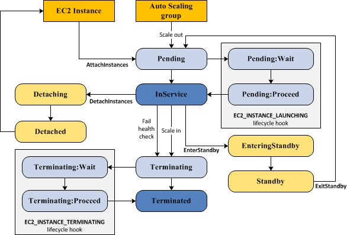

# Auto-Scaling

## Auto Scaling Components
  1. Goups
  2. Launch configuration as a template
  3. Scaling plans

## AMI ID
  - Amazon Machine Image (AMI)
  - Launch Configuration is a template that an Auto Scaling group uses to launch EC2 instances
  - when create a launach configuration, you specify information for the instances such as the AMI ID

https://docs.aws.amazon.com/ko_kr/autoscaling/ec2/userguide/LaunchConfiguration.html

## Auto Scaling Life Cycle
https://docs.aws.amazon.com/autoscaling/ec2/userguide/AutoScalingGroupLifecycle.html

### Attach EC2 to existing AutoScaling Group
https://docs.aws.amazon.com/autoscaling/ec2/userguide/attach-instance-asg.html

  premise

  1. The instance is in the <b><i>running</i></b> state
  2. The AMI used to launch the instance must still exist
  3. The instance is not a member of another Auto Scaling group
  4. The instance is in the same Availability Zone as the Auto Scaling group
  5. If the Auto Scaling group has an attache dload balancer, the instance and the load balancer must both be in EC2-Classic or the same VPC. If the Auto Scaling grop has an attached target group, the instance and the Application Load Balancer must both in the same VPC

### Scale out
  1. Manual Scaling
    * manually increase the size of the group
  2. Dynamic Scaling
    * create a scaling policy to automatically increase the size of the group based on a specified increase in demand
  3. Scheduled Scaling
    * set up scaling by schedule to increase the size of the group at a specific time

 
