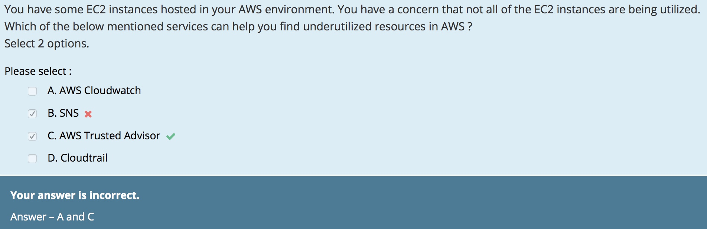

# CloudWatch

<b>Cloudwatch graphs : </b> CPU utilization of your resources and you can see the trend over time in the graphs

## Examples
### how to find underutilized resources

## Features
https://docs.aws.amazon.com/AmazonCloudWatch/latest/logs/WhatIsCloudWatchLogs.html

  - Monitor Logs from Amazon EC2 Instances in Real-time
  - Monitor AWS CloudTrail Logged Events
  - Log Retention
  - Archive Log Data
  - Log Route 53 DNS Queries

## The Types of Alarm states

1. Alarm
  - The metric is outside the defined threshold
2. Insufficient
  - INSUFFICIENT_DATA
  - The Alarm has just started, the metric is not availble, or not enough data is available for the metric to determine the Alarm state.
  - The checks may still be in progress on the volume
3. OK
  - The metric is within the defined threshold

## Evaluating an Alarm
  - Period
    + the length of time to evaluate the metric to create each individual data point
  - Evaluation Period
    + the number of the most recent data points
  - Datapoints to Alarm
    + the number of data points within the evaluation period (to caused the alarm to go to the ALARM state)

## Examples of problems
  - Loss of network connectivity
  - Loss of system power
  - Software issues on the physical host
  - Hardware issues on the pysical host that impact network reachability

https://docs.aws.amazon.com/ko_kr/AWSEC2/latest/UserGuide/monitoring-system-instance-status-check.html

## metrics
  - stop and start the instance based off of status check alarms.
  - Amazon EC2 인스턴스 모니터링
  - 기본 문제로 인해 인스턴스가 손상된 경우 인스턴스를 자동으로 복구하는 Amazon CloudWatch 경보 생성 가능

### categories
  1. CPU Usage
  2. Disk read operations
  3. Network in
  4. Memory Usage (optional)