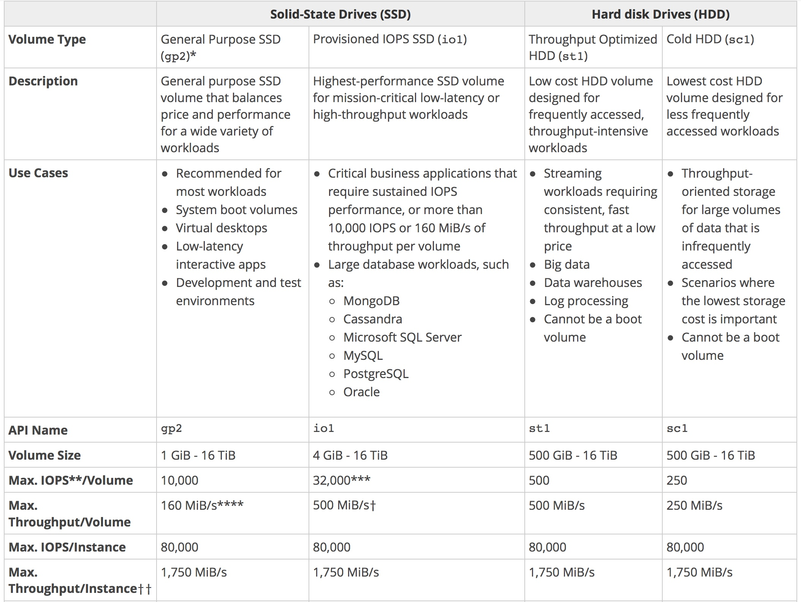
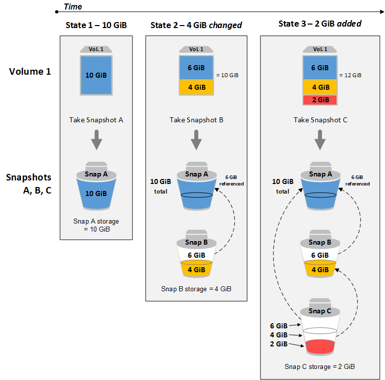

# EBS

## For High performance
always look to using IPOS as the preferred storage option.
  - Provisioned IOPS (max 32,000 **)
  
### Provisioned IOPS (I/O operation Per Seconds)
  - Maximum ratio is 50:1 (if volume size 8 GiB --> IOPS 400)

https://docs.aws.amazon.com/AWSEC2/latest/UserGuide/EBSVolumeTypes.html

## Snapshot
https://docs.aws.amazon.com/ko_kr/AWSEC2/latest/UserGuide/EBSSnapshots.html

특정 시점 스냅샷을 만들어 S3에 Amazon EBS 볼륨의 증분식 데이터 백업 (incremental backups of EBS volumes)

### How to backup the EBS Volumes
___
** Write a cronjob that uses the AWS CLI to take a snapshot of production EBS Volumes **

## Apply Encryption While Copying a Snapshot
1. Create a snapshot of your unencrypted EBS volume. This snapshot is also unencrypred
2. Copy the snapshot while applying encryption parameters. The resulting target snapshot is encrypted.
3. Restore the encrypted snapshot to a new volume, which is also encrypted.
