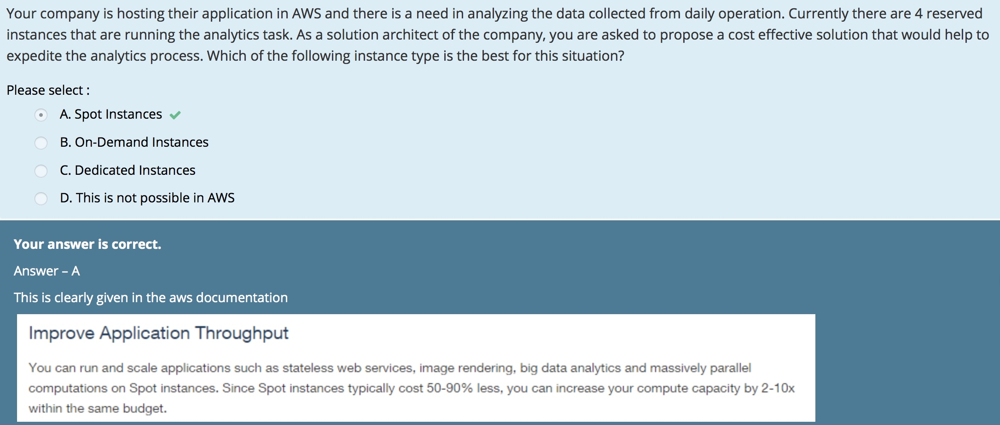
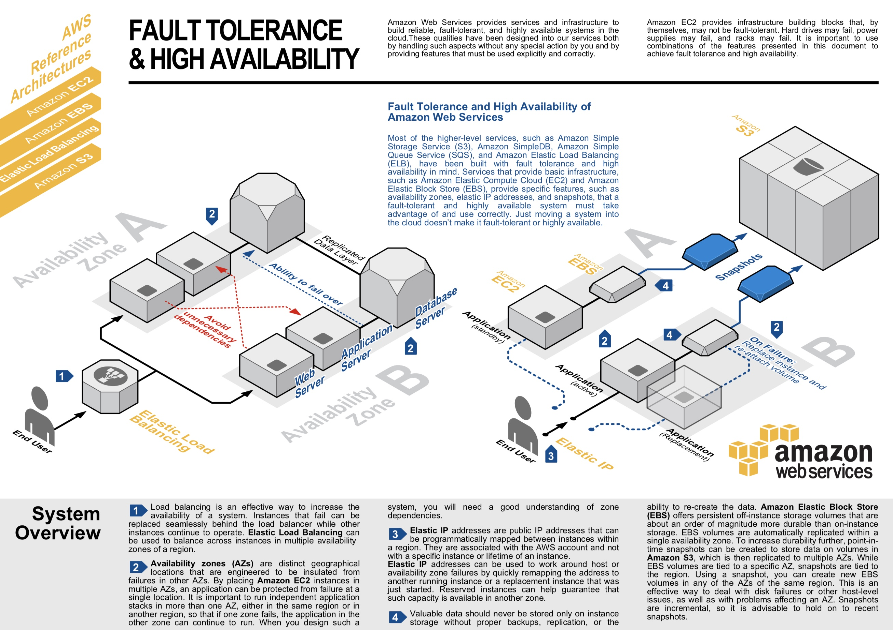

# EC2

## 인스턴스 유형

### I2 

https://aws.amazon.com/blogs/aws/amazon-ec2-new-i2-instance-type-available-now/

  - optimized to deliver tens of thousands of low-latency
  - random I/O operations per second (IOPS)
    
  1. NoSQL databases (e.g Cassandra, MongoDB)
  2. Clustered databases
  3. Online transaction processing (OLTP) system

## Key pairs
https://docs.aws.amazon.com/ko_kr/AWSEC2/latest/UserGuide/ec2-key-pairs.html

  - 퍼블릭 키 암호화 기법을 사용하여 로그인 정보를 암호화 및 해독
  - EBS 기반 인스턴스인 경우, 프라이빗 키를 분실하면 액세스 권한을 다시 얻을 수 있다.
    + 인스턴스 중지한 후, 루트 볼륨 분리
    + 다른 인스턴스에 데이터 볼륨으로 연결하여 authorized_key 파일 수정
    + 해당 볼륨을 원본 인스턴스로 복귀한 후, 재시작

## Auto-Scaling group
https://docs.aws.amazon.com/general/latest/gr/aws_service_limits.html

a limit of 20 on Running On-Demand instances.
The total number of running On-Demand instances that you can have in this region. 
Some instance types have different limits for this region that count against your total limit
these are listed below. Check the Current Limit column to find out how many instances per instance type you can run.

## Spot instances
https://aws.amazon.com/ko/ec2/spot/

  - 비용을 최적화하고 동일한 예산으로 애플리케이션 처리량을 최대 10배까지 늘릴 수 있다
  - 다양한 내결함성 및 유연한 애플리케이션에 사용 가능

### Exams

## placement group
https://docs.aws.amazon.com/AWSEC2/latest/UserGuide/placement-groups.html

  - Cluster
    + Clsuters intances into a low-latency group in a single Availability Zone
    + Pros (Network traffic)
      * low network low-latency
      * high network throughput

  - Spread
    + Spreads instances across underlying hardware

  - Ruls to cluster placement groups
    + General purpose : M4, M5, M5d
    + Compute optimized: C3, C4, C5, C5d, cc2.8xlarge
    + Memory optimized: cr1.8xlarge, R3, R4, R5, R5d, X1, X1e, z1d
    + Storage optimized: D2, H1, hs1.8xlarge, I2, I3, i3.metal
    + Accelerated computing: F1, G2, G3, P2, P3

## High Availability and Fault tolerance architecture
