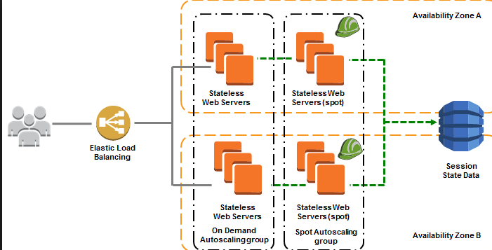

# Hosting

## Elasticity to set up web application
  1. Setup web app on more EC2 instances and set them behind an <b>Elastic Load balancer</b>
  2. Setup web app on more EC2 instances and use <b> Route 53 </b> to rout requests accordingly

## Static web site on an EC2 Instance
  1. An auto scaling group to recover from EC2 instance failures
  2. Elastic Load Balancer
  3. Multiple Availability Zones

  
