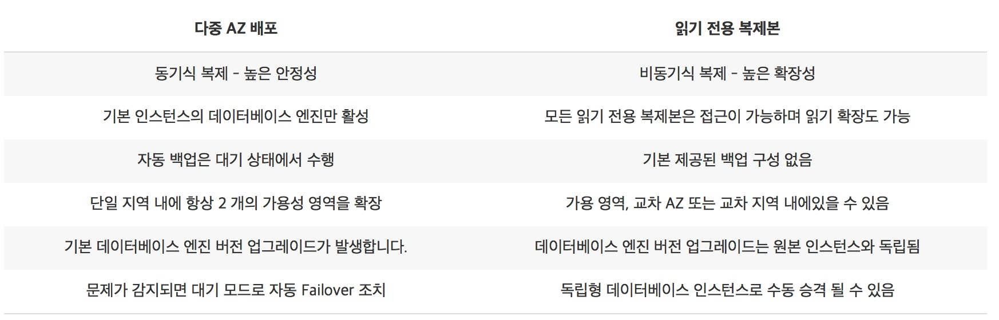
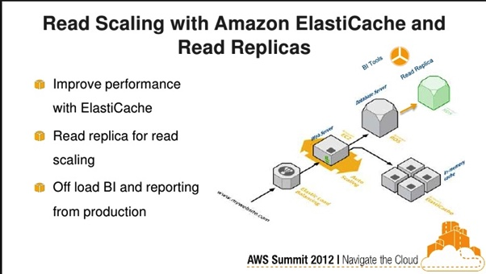

# RDS

## Best Practices for working with MySQL
https://docs.aws.amazon.com/AmazonRDS/latest/UserGuide/CHAP_BestPractices.html#CHAP_BestPractices.MySQLStorage

  - Automated backups are enabled for the RDS
  - Tables in the database do not get too large
  - File sizes for the RDS is well under 16 TB
  - Use the InnoDB Storage engine for MySQL

## Amazon RDS Multi-AZ Deployment (RDS 다중 AZ 배포)
## Benefits to add Multi-AZ deployment
  - MultiAZ deployed database can tolerate an Availability Zone failure
  - Make Database more available during maintenance tasks
  - If a storage volume on the primary fails in a Multi-AZ deployment, RDS automatically initiates a failover to the up-to-date standby

### Multi-AZ deployments for DB engines utilize synchronous physical replication to keep data on the standby up-to-date with the primary
  - MySQL
  - Oracle
  - MariaDB
  

## Read Replicas
  https://aws.amazon.com/rds/details/read-replicas/

  - 읽기 전용 복제본
  - enhanced performance
  - durability
  - 대표 데이터베이스
    + MySQL
    + MariaDB
    + PostgreSQL
    + Amazon Aurora

  단일 DB 인스턴스 용량 한도 이상으로 탄력적으로 확장하여 읽기 중심의 데이터베이스 워크로드를 쉽게 처리
  대량의 애플리케이션 읽기 트래픽 처리 가능

### Read Scaling

