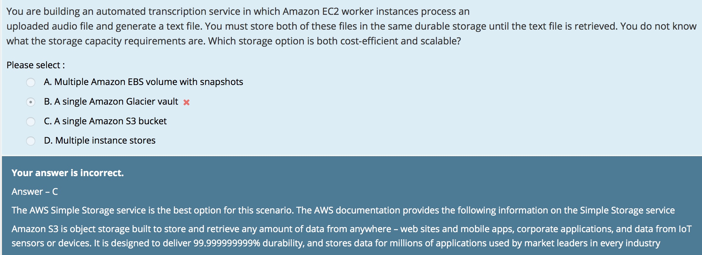

# S3 (Simple Storage Service)
https://docs.aws.amazon.com/ko_kr/AmazonS3/latest/dev/Welcome.html

  - storage for the internet
  - It is designed to make web-scale computing easier for developers

## Bucket Restriction
https://docs.aws.amazon.com/AmazonS3/latest/dev/BucketRestrictions.html

  - Bucket names must be at least 3 and no more than 63 characters long
  - Bucket names can contain lowercase letter, numbers, hyphens (숫자 혹은 소문자로 시작/끝나야 한다)
  - Bucket name must not be formatted as an IP address
  - Recommend to do not use periods(".") in bucket names

## Cross-Region Replication
  - Versioning-enabled
  - Between in Different AWS regions
  - Replicate object to only one destination bucket
  - Permission to replicate from source to destination bucket
  - Source owner's Full permissions to replicate or ACL
  - if in a cross-account scenario, owner must have permission to replicate objects in the destination bucket

## Exams
### process uploaded audio file and generate a text file that is retrieved

## Website Endpoints
https://docs.aws.amazon.com/AmazonS3/latest/dev/WebsiteEndpoints.html
https://docs.aws.amazon.com/AmazonS3/latest/dev/HostingWebsiteOnS3Setup.html

    - <bucket-name>.s3-website-<AWS-region>.amazonaws.com
    - <bucket-name>.s3-website.<AWS-region>.amazonaws.com
    - Notice: HTTPS access to the website is not supported

## 보안
### Storing wihtout accidentally deleted by anyone

1. Enable Versioning for the S3 bucket
2. Enable Multi-Factor authentication(MFA) Delete

https://aws.amazon.com/ko/premiumsupport/knowledge-center/s3-undelete-configuration

If both versioning and root account MFA delete support are enabled, any files deleted from the bucket are marked for deletion and no longer visible to non-multi-factor authenticated users, even if the user is a bucket owner. Files marked for deletion in this scenario can only be permanently deleted by using multi-factor-authenticated root account credentials with bucket owner permissions.

## RRS (Reduced Redundancy Storage)
https://aws.amazon.com/ko/s3/reduced-redundancy

  - 중요하지 않고 재생성 가능한 데이터를 저장할 수 있는 스토리지 옵션
  - 99.99% 내구성(durability) & 99.99% (availability)
  - need to design automation around replacing lost objects.
  - use lifecycle policies to delete the data since it is not required

### 객체 생명 주기 관리 (Object LifeCycle Management)
https://docs.aws.amazon.com/ko_kr/AmazonS3/latest/dev/object-lifecycle-mgmt.html

  - 전환 작업 (Transaction actions)
    + 30일 후 STANDARD_IA 스토리지 클래스 전환
    + 1년 후 GLACIER 스토리지 클래스에 보관
  - 만료 작업 (Expiration actions)
    + Define when objects expire

