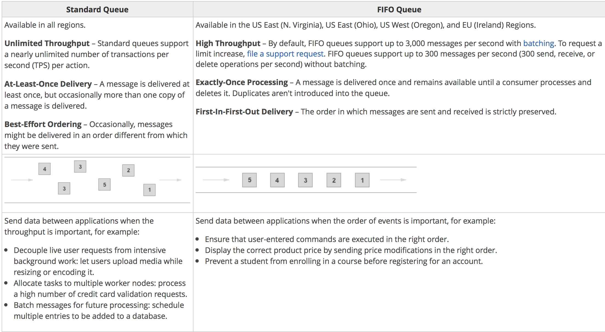

# SQS (Simple Queue Service)
https://aws.amazon.com/ko/sqs/?nc1=h_ls

완전관리형 메시지 대기열 서비스

## How long messages live in a SQS queues
  - retension period to a value from 1 minutes to 14 days
  - default is 4 days
  - Maximum Message Size: 256 KB

https://aws.amazon.com/sqs/faqs/

## Type
  

## SSE
AWS Server-Side Encryption

  - SSE encrypts messages as soon as Amazon SQS receives them
  - The messages are stored in encrypted form
  - SQS decrypts messages only when they are sent to an authorized customer

## Loose coupling

## PipeLine SQS Architecture

