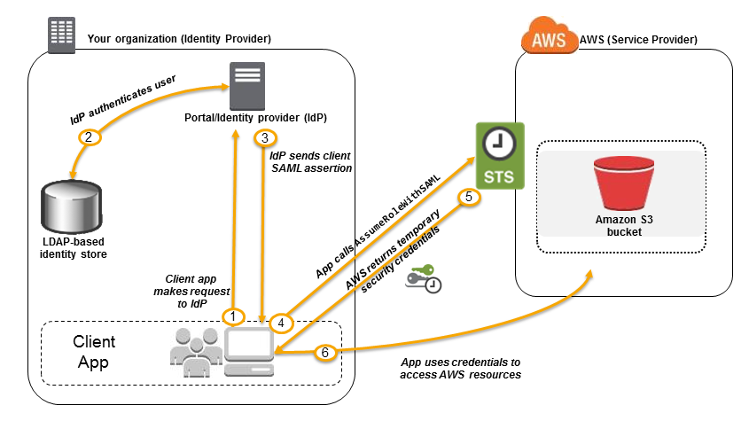

# Security
https://docs.aws.amazon.com/AmazonVPC/latest/UserGuide/VPC_Security.html

  - Security groups : as a firewall for associated Amazon EC2 instances, controlling both inbound and outbound (ports)
  - Network Access Control Lists (ACLs) : as a firewall for associated subnets
  - Flow logs : capture <ins></ins>formation about the IP traffic going

### Security Groups or Network ACL's
  filter only on destination ports  
  when add or remove rules, <b> automatically applied (immediately) </b>to all instances associated with it.

  - single IPv4 address --> using the /32 prefix length
  - single IPv6 address --> using the /128 prefix length
  
## STS (AWS Secure Token Service)
https://docs.aws.amazon.com/IAM/latest/UserGuide/id_credentials_temp.html

### SAML 2.0 (Security Assertion Markup Language)

