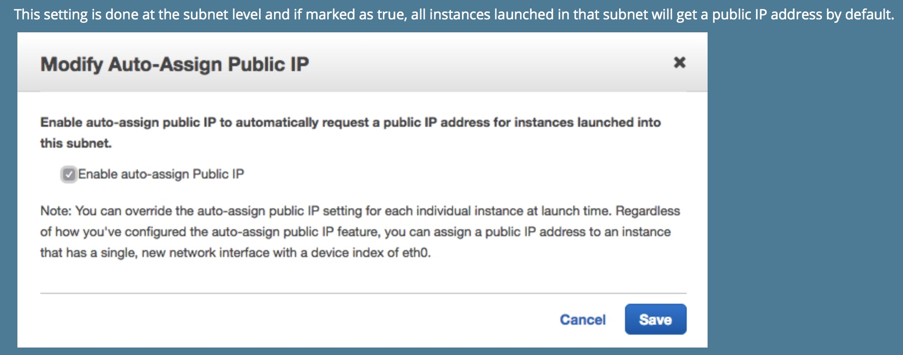

# Subnet

## CIDR block
  - The available IP addresses is ** 32 ** addresses
  - 첫 4개의 IP 주소와 마지막 IP 주소는 예약되어 있음
      + 10.0.0.0 : Network address
      + 10.0.0.1 : Reserved by AWS (for VPC Router)
      + 10.0.0.2 : Reserved by AWS
      + 10.0.0.3 : Reserved by AWS
      + 10.0.0.255 : Network boradcast address

## 인스턴스 시작하는 과정에서 인스턴스에 public IPv4 주소를 할당하려면

https://docs.aws.amazon.com/ko_kr/AmazonVPC/latest/UserGuide/vpc-ip-addressing.html#vpc-public-ip

https://docs.aws.amazon.com/AmazonVPC/latest/UserGuide/vpc-ip-addressing.html

