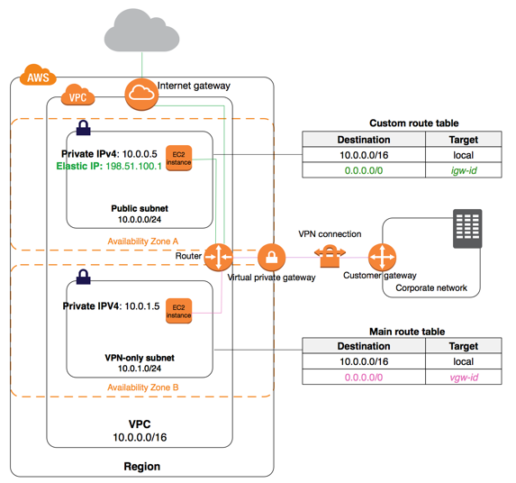

# VPC (Virtual Private Cloud)
https://aws.amazon.com/ko/vpc/faqs/?nc1=h_ls

## 구성 요소
  1. Virtual Private Cloud : AWS 클라우드 내의 논리적으로 격리된 (isolated) 가상 네트워크
  2. Subnet : 격리된 리소스 그룹을 배치할 수 있는 VPC IP 주소 범위의 세그먼트
  3. Internet Gateway : 인터넷에 연결되는 VPC Gateway
  4. NAT Gateway : Private subnet에 있는 리소스가 인터넷에 액세스할 수 있도록 해주는 NAT 서비스 (Network Address Translation) 
  5. Hardware VPN Connection
  6. Virtual Private Gateway : VPN에 연결
  7. Customer Gateway
  7. Peering Connection : route traffic via private IP addresses between two peered VPCs
  8. VPC Endpoints
  9. Egress-only Internet Gateway

## Security Groups or Network ACL's
  filter only on destination ports  
  when add or remove rules, <b> automatically applied (immediately) </b>to all instances associated with it.

  - single IPv4 address --> using the /32 prefix length
  - single IPv6 address --> using the /128 prefix length

## 유형
### Default VPCs
  - a logically isolated virtual network
  - automatically created for your AWS Account the first time you provision Aamazon EC2 resources

## Hosting a set of web and database servers
1. The web servers in a public subnet.
   The users can then access the application or web url via the Internet gateway to the web server.
2. The database servers in a private subnet. The database servers don't need to be accessed by the end users.

https://docs.aws.amazon.com/ko_kr/AmazonVPC/latest/UserGuide/VPC_Subnets.html

## In order for the EC2 or ELBs to be accessible from internet
  - configure the route table for public subnet to route traffic to VPC internet gateway
    + https://docs.aws.amazon.com/ko_kr/AmazonVPC/latest/UserGuide/VPC_Route_Tables.html
    + Route table: 네트워크 트래픽을 전달할 위치를 결정하는데 사용되는 라우팅 규칙 포함
    
  - Add a rule on the instance's security group to allow traffic from the ELB's Security Group
  
  
  
## Routing

### Interget Gateway
### NAT device
  - for instances in private subnet
  
### Virtual Private Gateway
### VPC Peering Connection
  - 두 VPC 간에 트래픽을 라우틱할 수 있게 해주는 두 VPC 사이의 네트워킹 연결

### ClassicLink
  - EC2-Classic 인스턴스를 VPC에 연결

### Egress-Only Internet Gateway
  - VPC endpoint 와 다른 AWS Service 사이에 프라이빗 연결 생성
